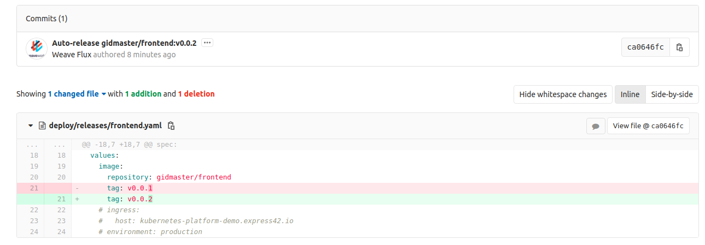

# Домашнее задание 11

[Содержание](../README.md)

*NB: Использован дистрибутив `Ubuntu 18.04` с предустановленным `gcloud/gsutils`, `helm3`, `kubectl` и `terraform`. А так же для выполнения задания был использованн собственный DNS домен.*

1. В качестве Репозитория и CI-системы в домашнем задании мы будем использовать GitLab.

    Создадим в GitLab публичный проект `microservices-demo`.

2. Подготовка GitLab репозитория

    Переместим в проект `microservices-demo` код из GitHub репозитория с Демо сайтом.

    ```bash
    git clone https://github.com/GoogleCloudPlatform/microservices-demo
    cd microservices-demo

    git config user.name "Konstantin Syrovatsky"
    git config user.email "k.syrovatsky@gmail.com"

    git remote add gitlab git@gitlab.com:gidmaster/microservices-demo.git
    git remote remove origin
    git push gitlab master
    ```

3. Создание Helm чартов

    Возьмём Helm чарты из готового демонстранционного [репозиотрия](https://gitlab.com/express42/kubernetes-platform-demo/microservices-demo).

    ```bash
    cd ..
    mkdid demo-charts
    cd demo-charts
    git clone git@gitlab.com:express42/kubernetes-platform-demo/microservices-demo.git
    cd microservices-demo
    sed -i 's/avtandilko/gidmaster/g' /deploy/chars/*/values.yaml
    cp -R deploy/ ../../microservices-demo
    cd ..
    rm -rf demo-charts
    ```

    Проверим:

    ```bash
    cd microservices-demo
    tree -L 1 deploy/charts
    deploy/charts
    ├── adservice
    ├── cartservice
    ├── checkoutservice
    ├── currencyservice
    ├── emailservice
    ├── frontend
    ├── grafana-load-dashboards
    ├── loadgenerator
    ├── paymentservice
    ├── productcatalogservice
    ├── recommendationservice
    └── shippingservice
    ```

4. Подготовка Kubernetes кластера:

    Развернём кластер GKE используя `terraform`. Понадобится как минимум 4 ноды типа `n1-standard-2`.

    ```bash
    cd kubernetes-gitops/terraform
    terraform init
    terraform apply --auto-approve=true
    cd ..
    ```

5. Подключимся к кластеру:

    ```bash
    gcloud container clusters get-credentials k8s-platform --zone us-west1-a --project k8s-platform-266222
    ```

6. Continuous Integration.

    Соберите Docker образы для всех микросервисов и поместим данные образы в Docker Hub

    ```bash
    cd ./src
    for d in *; do
        cd "$(pwd)/$d";
        docker build  -t gidmaster/$d:v0.0.1 .
        docker push gidmaster/$d:v0.0.1
        cd ..;
    done
    ```

7. GitOps. Подготовка.

    Установим CRD, добавляющую в кластер новый ресурс - `HelmRelease`:

    ```bash
    kubectl apply -f https://raw.githubusercontent.com/fluxcd/helm-operator/master/deploy/crds.yaml
    ```

    **NB: В ДЗ указан не верный URL.**

    Добавим официальный репозиторий Flux:

    ```bash
    helm repo add fluxcd https://charts.fluxcd.io
    ```

    Создадим `flux.values.yaml` на основе этого [файла](https://raw.githubusercontent.com/express42/otus-platform-snippets/master/Module-02/GitOps/flux.values.yaml) (поменяем URL) со значениями. Произведем установку Flux в кластер, в namespace flux

    ```bash
    kubectl create namespace flux
    helm upgrade --install flux fluxcd/flux -f flux.values.yaml --namespace flux
    ```

    Создадим `helm-operator.values.yaml` на основе этого [файла](https://github.com/express42/otus-platform-snippets/blob/master/Module-02/GitOps/helm-operator.values.yaml) (поменяем )со значениями. Установим Helm operator:

    ```bash
    helm upgrade --install helm-operator fluxcd/helm-operator -f helm-operator.values.yaml --namespace flux
    ```

    Установим fluxctl на локальную машину для управления нашим CD инструментом. [Документация](https://docs.fluxcd.io/en/stable/references/fluxctl.html):

    ```bash
    sudo snap install fluxctl --classic
    export FLUX_FORWARD_NAMESPACE=flux
    ```

    Разрешим Flux сгенерировать ключ для нас:

    ```bash
    fluxctl identity
    ```

    Ключик (вывод команды) добавим `"User>Settings>SSH Keys"` в нашем аккаунте GitLabCI.

8. Проверка.

    Проверим корректность работы Flux. Flux должен автоматически синхронизировать состояние кластера и репозитория. Это касается не только сущностей HelmRelease, которыми мы будем оперировать для развертывания приложения, но и обыкновенных манифестов.

    Поместим манифест, описывающий namespace microservices-demo в директорию deploy/namespaces и сделайхем push в GitLab:

    ```yaml
    apiVersion: v1
    kind: Namespace
    metadata:
      name: microservices-demo
    ```

    Посмотрим Появился ли новый namespace:

    ```bash
    kubectl get namespaces
    NAME                 STATUS   AGE
    default              Active   3h3m
    flux                 Active   45m
    kube-node-lease      Active   3h4m
    kube-public          Active   3h4m
    kube-system          Active   3h4m
    microservices-demo   Active   54s
    ```

    Посмотрим в логи flux

    ```bash
    kubectl logs -n flux
    #--- Ommited output ---
    ts=2020-03-18T21:07:28.502238715Z caller=loop.go:133 component=sync-loop event=refreshed url=ssh://git@gitlab.com/gidmaster/microservices-demo.git branch=master HEAD=25a51e3093004cb636e7f2426527e3704eee3439
    ts=2020-03-18T21:07:33.754508182Z caller=sync.go:528 method=Sync cmd=apply args= count=14
    ts=2020-03-18T21:07:34.074013806Z caller=sync.go:594 method=Sync cmd="kubectl apply -f -" took=319.41208ms err=null output="namespace/microservices-demo unchanged\nnamespace/production unchanged\nhelmrelease.helm.fluxcd.io/adservice unchanged\nhelmrelease.helm.fluxcd.io/cartservice unchanged\nhelmrelease.helm.fluxcd.io/checkoutservice unchanged\nhelmrelease.helm.fluxcd.io/currencyservice unchanged\nhelmrelease.helm.fluxcd.io/emailservice unchanged\nhelmrelease.helm.fluxcd.io/frontend unchanged\nhelmrelease.helm.fluxcd.io/grafana-load-dashboards unchanged\nhelmrelease.helm.fluxcd.io/loadgenerator unchanged\nhelmrelease.helm.fluxcd.io/paymentservice unchanged\nhelmrelease.helm.fluxcd.io/productcatalogservice unchanged\nhelmrelease.helm.fluxcd.io/recommendationservice unchanged\nhelmrelease.helm.fluxcd.io/shippingservice unchanged"
    ts=2020-03-18T21:07:34.741385319Z caller=rate_limiter.go:71 component=ratelimiter info="reducing rate limit" host=index.docker.io limit=100.00
    ts=2020-03-18T21:07:34.741593448Z caller=repocachemanager.go:215 component=warmer canonical_name=index.docker.io/bitnami/redis auth={map[]} warn="aborting image tag fetching due to rate limiting, will try again later"
    ts=2020-03-18T21:07:57.386398791Z caller=images.go:17 component=sync-loop msg="polling for new images for automated workloads"
    ```

9. HelmRelease

    Cоздадим директорию `deploy/releases` и поместим туда файл `frontend.yaml`. затем запушим изменния и проверим, что fronend pod появился в namespace microservices-demo

    ```bash
    git add .
    git commit -m "Updated relase frontend"
    git push gitlab

    kubectl get helmrelease -n microservices-demo
    NAME       RELEASE    STATUS     MESSAGE                       AGE
    frontend   frontend   deployed   Helm release sync succeeded   10m

    helm list -n microservices-demo
    NAME            NAMESPACE               REVISION        UPDATED                                 STATUS          CHART           APP VERSION
    frontend        microservices-demo      1               2020-03-19 21:02:00.655403438 +0000 UTC deployed        frontend-0.21.0 1.16.0
    ```

10. Обновление образа

    Внесём изменения в исходный код микросервиса frontend (не имеет значения, какие) и пересоберём образ, при этом инкрементировав версию тега (до v0.0.2)

    ```bash
    cd src/frontend
    docker build  -t gidmaster/frontend:v0.0.2 .
    docker push gidmaster/frontend:v0.0.2
    ```

    Дождёмся автоматического обновления релиза в Kubernetes кластере

    ```bash
    helm history frontend -n microservices-demo
    REVISION        UPDATED                         STATUS          CHART           APP VERSION     DESCRIPTION
    1               Thu Mar 19 21:01:25 2020        superseded      frontend-0.21.0 1.16.0          Install complete
    2               Thu Mar 19 21:02:00 2020        superseded      frontend-0.21.0 1.16.0          Upgrade complete
    3               Thu Mar 19 21:18:24 2020        deployed        frontend-0.21.0 1.16.0          Upgrade complete
    helm list -n microservices-demo
    NAME            NAMESPACE               REVISION        UPDATED                                 STATUS          CHART           APP VERSION
    frontend        microservices-demo      3               2020-03-19 21:18:24.173145373 +0000 UTC deployed        frontend-0.21.0 1.16.0  
    ```

    Проверим, изменилось ли что-либо в git-репозитории (в частности, в файле deploy/releases/frontend.yaml)

    

11. Обновление Helm chart

    Попробуем внести изменения в Helm chart `frontend` и поменять имя deployment на frontend-hipster

    ```bash
    sed -i 's/name: frontend/name: frontend-hipster/g' /deploy/chars/frontend/Chart.yaml
    ```

    Сделаем push измененного Helm chart в GitLab и понаблюдайте за процессом.

    ```bash
    git add .
    git commit -m "cahnged name frontend chart"
    git push gitlab
    ```

    Найдём в логах helm-operator строки, указывающие на механизм проверки изменений в Helm chart и определения необходимости обновить релиз.

    ```log
    ts=2020-03-19T21:41:17.289472552Z caller=release.go:360 component=release release=frontend targetNamespace=microservices-demo resource=microservices-demo:helmrelease/frontend helmVersion=v3 info="performing dry-run upgrade to see if release has diverged"
    ts=2020-03-19T21:41:17.291632571Z caller=helm.go:69 component=helm version=v3 info="preparing upgrade for frontend" targetNamespace=microservices-demo release=frontend
    ts=2020-03-19T21:41:17.944814591Z caller=helm.go:69 component=helm version=v3 info="performing update for frontend" targetNamespace=microservices-demo release=frontend
    ts=2020-03-19T21:41:17.962387822Z caller=helm.go:69 component=helm version=v3 info="dry run for frontend" targetNamespace=microservices-demo release=frontend
    ts=2020-03-19T21:41:17.967692289Z caller=release.go:404 component=release release=frontend targetNamespace=microservices-demo resource=microservices-demo:helmrelease/frontend helmVersion=v3 info="no changes" action=skip
    ```

12. Добавим манифесты HelmRelease для всех микросервисов входящих в состав HipsterShop. И Запушим изменения в репозтиторий Flux сделает всё остальное.

13. Проверим, что все микросервисы успешно развернулись в нашем Kubernetes кластере

    ```bash
    helm list -n microservices-demo
    NAME                    NAMESPACE               REVISION        UPDATED                                 STATUS          CHART                           APP VERSION
    adservice               microservices-demo      1               2020-03-23 18:27:23.261725217 +0000 UTC deployed        adservice-0.5.0                 1.16.0
    cartservice             microservices-demo      1               2020-03-23 18:27:34.261558527 +0000 UTC deployed        cartservice-0.4.1               1.16.0
    checkoutservice         microservices-demo      1               2020-03-23 18:27:24.917388568 +0000 UTC deployed        checkoutservice-0.4.0           1.16.0
    currencyservice         microservices-demo      1               2020-03-23 18:27:26.068964235 +0000 UTC deployed        currencyservice-0.4.0           1.16.0
    emailservice            microservices-demo      1               2020-03-23 18:27:27.936351012 +0000 UTC deployed        emailservice-0.4.0              1.16.0
    frontend                microservices-demo      2               2020-03-23 18:27:45.455446016 +0000 UTC deployed        frontend-hipster-0.21.0         1.16.0
    grafana-load-dashboards microservices-demo      1               2020-03-23 18:27:29.992409861 +0000 UTC deployed        grafana-load-dashboards-0.0.3
    loadgenerator           microservices-demo      1               2020-03-23 18:27:31.972157431 +0000 UTC deployed        loadgenerator-0.4.0             1.16.0
    paymentservice          microservices-demo      1               2020-03-23 18:27:34.790796059 +0000 UTC deployed        paymentservice-0.3.0            1.16.0
    productcatalogservice   microservices-demo      1               2020-03-23 18:27:40.527155387 +0000 UTC deployed        productcatalogservice-0.3.0     1.16.0

    kubectl get helmrelease -n microservices-demo
    NAME                      RELEASE                   STATUS     MESSAGE                       AGE
    adservice                 adservice                 deployed   Helm release sync succeeded   59s
    cartservice               cartservice               deployed   Helm release sync succeeded   59s
    checkoutservice           checkoutservice           deployed   Helm release sync succeeded   59s
    currencyservice           currencyservice           deployed   Helm release sync succeeded   59s
    emailservice              emailservice              deployed   Helm release sync succeeded   59s
    frontend                  frontend                  deployed   Helm release sync succeeded   9m10s
    grafana-load-dashboards   grafana-load-dashboards   deployed   Helm release sync succeeded   59s
    loadgenerator             loadgenerator             deployed   Helm release sync succeeded   59s
    paymentservice            paymentservice            deployed   Helm release sync succeeded   59s
    productcatalogservice     productcatalogservice     deployed   Helm release sync succeeded   59s
    ```

14. Устновка Istio

    Установка Istio [документация](https://istio.io/docs/setup/install/istioctl/)

    [Get started](https://istio.io/docs/setup/getting-started/)

    ```bash
    curl -L https://istio.io/downloadIstio | sh -
    cd istio-1.5.0/bin
    cp instioctl $HOME/.local/bin

    istioctl manifest apply --set profile=demo
    ```

    Для проверки задеплоим приложение мз примера.

    ```bash
    kubectl apply -f samples/bookinfo/platform/kube/bookinfo.yaml
    kubectl get services
    NAME          TYPE        CLUSTER-IP      EXTERNAL-IP   PORT(S)    AGE
    details       ClusterIP   10.15.245.192   <none>        9080/TCP   32s
    kubernetes    ClusterIP   10.15.240.1     <none>        443/TCP    45m
    productpage   ClusterIP   10.15.246.137   <none>        9080/TCP   27s
    ratings       ClusterIP   10.15.251.208   <none>        9080/TCP   31s
    reviews       ClusterIP   10.15.250.70    <none>        9080/TCP   29s
    kubectl get pods
    NAME                              READY   STATUS    RESTARTS   AGE
    details-v1-74f858558f-mrv82       1/1     Running   0          59s
    productpage-v1-76589d9fdc-kjgvw   1/1     Running   0          54s
    ratings-v1-7855f5bcb9-c77vc       1/1     Running   0          58s
    reviews-v1-64bc5454b9-m9dc8       1/1     Running   0          56s
    reviews-v2-76c64d4bdf-r67pz       1/1     Running   0          56s
    reviews-v3-5545c7c78f-czv4z       1/1     Running   0          56s
    ```

    Проверим, что всё работает верно:

    ```bash
    kubectl exec -it $(kubectl get pod -l app=ratings -o jsonpath='{.items[0].metadata.name}') -c ratings -- curl productpage:9080/productpage | grep -o "<title>.*</title>"
    <title>Simple Bookstore App</title>
    ```

    Откроем доступ к приложению снаружи:

    ```bash
    kubectl apply -f samples/bookinfo/networking/bookinfo-gateway.yaml

    kubectl get gateway
    NAME               AGE
    bookinfo-gateway   11s
    ```

    Узнаем адрес лоадбалансера:

    ```bash
    kubectl get svc istio-ingressgateway -n istio-system
    NAME                   TYPE           CLUSTER-IP    EXTERNAL-IP     PORT(S)                                                                                                                                      AGE
    istio-ingressgateway   LoadBalancer   10.15.242.6   35.247.90.220   15020:30034/TCP,80:30609/TCP,443:32521/TCP,15029:31828/TCP,15030:31867/TCP,15031:32180/TCP,15032:31801/TCP,31400:31718/TCP,15443:32177/TCP   7m11s
    ```

15. Установка Flagger

    Добавление helm-репозитория flagger:

    ```bash
    helm repo add flagger https://flagger.app
    ```

    Установка CRD для Flagger:

    ```bash
    kubectl apply -f https://raw.githubusercontent.com/weaveworks/flagger/master/artifacts/flagger/crd.yaml
    ```

    Установка flagger с указанием использовать Istio:

    ```bash
    helm upgrade --install flagger flagger/flagger \
    --namespace=istio-system \
    --set crd.create=false \
    --set meshProvider=istio \
    --set metricsServer=http://prometheus:9090
    ```

16. Istio | Sidecar Injection

    Добавим к описанию namespace `miscroservices-demo` label который указывает на необходимость добавить в каждый pod sidecar контейнер с envoy proxy.

    ```yaml
    metadata:
      labels:
        istio-injection: enabled
    ```

    запушим в репозиторий изменения:

    ```bash
    git add .
    git commit -m "added sidecar envoy injection for microservices-demo"
    [master 1ae651e] added sidecar envoy injection for microservices-demo
    1 file changed, 3 insertions(+), 1 deletion(-)
    git push gitlab
    ```

    Проверим, что лейбл добавился:

    ```bash
    kubectl get ns microservices-demo --show-labels
    ```

    Удалим все поды в namespace `microservices-demo`, что бы добавить в конейнеры sidecar

    ```bash
    kubectl delete pods --all -n microservices-demo
    ```

    проверим что есть sidecar конейнер `istio-proxy`

    ```bash
    kubectl describe pod -l app=frontend -n microservices-demo
    # --- ommited output
      istio-proxy:
        Container ID:  docker://8882fbd254f448379177af8111a8614eabe02d00d417a242127dbe2bff2281ba
        Image:         docker.io/istio/proxyv2:1.5.0
        Image ID:      docker-pullable://istio/proxyv2@sha256:89b5fe2df96920189a193dd5f7dbd776e00024e4c1fd1b59bb53867278e9645a
        Port:          15090/TCP
        Host Port:     0/TCP
    # --- ommited output
    ```

17. Доступ к frontend

    На текущий момент у нас отсутствует ingress и мы не можем получить доступ к frontend снаружи кластера.
    В то же время Istio в качестве альтернативы классическому ingress предлагает свой набор абстракций.
    Чтобы настроить маршрутизацию трафика к приложению с использованием Istio, нам необходимо добавить ресурсы VirtualService и Gateway.

    Создим директорию deploy/istio и поместим в неё следующие манифесты:
    * frontend-vs.yaml
    * frontend-gw.yaml

    И запушим изменения.

    Созданный Gateway можно увидеть следующим образом:

    ```bash
    kubectl get gateway -n microservices-demo
    ```

    Для доступа снаружи нам понадобится EXTERNAL-IP сервиса istio-ingressgateway

    ```bash
    kubectl get svc istio-ingressgateway -n istio-system
    ```

    Теперь мы можем обращаться к frontend так http://EXTERNAL-IP

18. Перенесём манифесты Gateway и VirtualService в Helm chart frontend.
    * gateway.yaml
    * virtualService.yaml

    Оригинальные манифесты удалим вместе с директорией deploy/istio.

19. Flagger | Canary

    Перейдем непосредственно к настройке канареечных релизов.

    Добавим в Helm chart frontend еще один файл - canary.yaml В нем будем хранить описание стратегии, по которой необходимо обновлять данный микросервис.

    Проверим, Flagger:

    Успешно инициализировал canary ресурс frontend:

    ```bash
    kubectl get canary -n microservices-demo
    NAME       STATUS        WEIGHT   LASTTRANSITIONTIME
    frontend   Initialized   0        2020-03-28T18:27:24Z
    ```

    Обновил pod, добавив ему к названию постфикс primary:

    ```bash
    kubectl get pods -n microservices-demo -l app=frontend-primary
    NAME                                READY   STATUS    RESTARTS   AGE
    frontend-primary-684f56c555-wvbsd   2/2     Running   0          13m
    ```

    Попробуем провести релиз. Соберите новый образ frontend с тегом v0.0.3 и сделайте push в Docker Hub.

    ```bash
    cd src/frontend
    docker build  -t gidmaster/frontend:v0.0.3 .
    docker push gidmaster/frontend:v0.0.3
    ```

    Через некоторое время в выводе kubectl `describe canary frontend -n microservices-demo` мы сможет наблюдать следующую картину:

    ```bash
    describe canary frontend -n microservices-demo
    #--- ommited output ---
    Events:
    Type     Reason  Age                From     Message
    ----     ------  ----               ----     -------
    Warning  Synced  43m                flagger  IsPrimaryReady failed: primary daemonset frontend-primary.microservices-demo not ready: waiting for rollout to finish: observed deployment generation less then desired generation
    Normal   Synced  42m                flagger  Initialization done! frontend.microservices-demo
    Normal   Synced  13m                flagger  New revision detected! Scaling up frontend.microservices-demo
    Normal   Synced  12m                flagger  Starting canary analysis for frontend.microservices-demo
    Normal   Synced  12m                flagger  Advance frontend.microservices-demo canary weight 5
    Warning  Synced  10m (x5 over 12m)  flagger  Halt advancement no values found for istio metric request-duration probably frontend.microservices-demo is not receiving traffic
    Warning  Synced  9m50s              flagger  Rolling back frontend.microservices-demo failed checks threshold reached 5
    Warning  Synced  9m50s              flagger  Canary failed! Scaling down frontend.microservices-demo
    ```

    Это произошло из-за не верное настроеного load-generator (который настроен на внутренний адрес) и не хватало метрик для анализа релиза.

    Изменим `values.yaml`  указав правильный ingress хост для loadgenerator, закоммитим, и запушим. Подождём и увидим.

    ```bash
    describe canary frontend -n microservices-demo
    #--- ommited output ---
    Events:
    Type Reason Age From Message
    ---- ------ ---- ---- -------
    Normal Synced 8m27s flagger New revision detected! Scaling up
    frontend.microservices-demo
    Normal Synced 7m58s flagger Starting canary analysis for frontend.microservicesdemo
    Normal Synced 7m57s flagger Advance frontend.microservices-demo canary weight 5
    Normal Synced 6m27s flagger Advance frontend.microservices-demo canary weight 10
    Normal Synced 5m57s flagger Advance frontend.microservices-demo canary weight 15
    Normal Synced 5m27s flagger Advance frontend.microservices-demo canary weight 20
    Normal Synced 3m57s flagger Advance frontend.microservices-demo canary weight 25
    Normal Synced 3m27s flagger Advance frontend.microservices-demo canary weight 30
    ```

    Canary deployment работатет!

[Назад к содержанию](../README.md)
