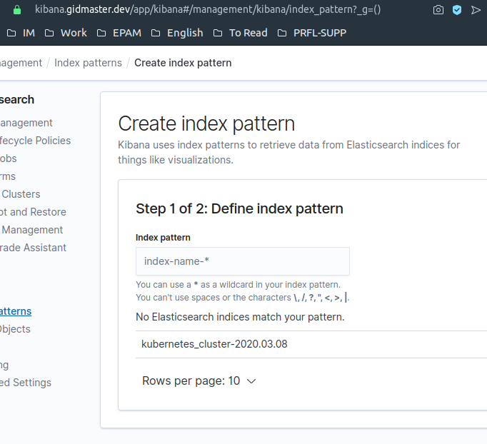
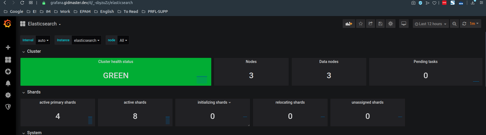
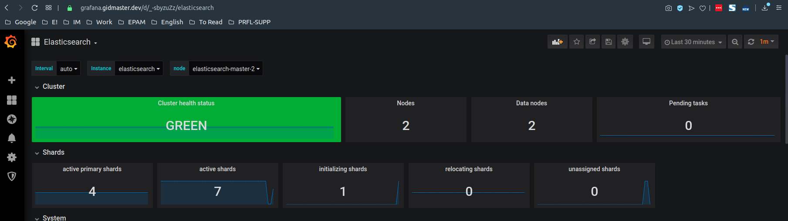

# Домашнее задание 9

[Содержание](../README.md)

*NB: Использован дистрибутив `Ubuntu 18.04` с предустановленным `gcloud/gsutils`, `helm3`. А так же для выполнения задания был использованн собственный доменом*

1. Подготовка Kubernetes кластера:

    Для выполнения домашнего задания понадобится:
    * Как минимум 1 нода типа n1-standard-2 в default-pool
    * Как минимум 3 ноды типа n1-standard-2 в infra-pool

    обратите внимание, что мы отключим Stackdriver, компоненты которого устанавливаются по-умолчанию при создании GKE кластера:

    ```hcl
    logging_service    = "none"
    monitoring_service = "none"
    ```

    Cоздадим k8s кластер с помощью `terraform`

    ```bash
    cd kubernetes-logging/terraform
    terraform init
    terraform apply --auto-approve=true
    cd ..
    ```

    Присвоим этим нодам из `infra pool` определенный taint, чтобы избежать запуска на них случайных pod.

    ```bash
    kubectl get nodes
    NAME                                          STATUS   ROLES    AGE   VERSION
    gke-k8s-platform-default-pool-4f28c669-nkg9   Ready    <none>   18m   v1.15.9-gke.12
    gke-k8s-platform-infra-pool-61d602db-80zt     Ready    <none>   16m   v1.15.9-gke.12
    gke-k8s-platform-infra-pool-61d602db-d07r     Ready    <none>   16m   v1.15.9-gke.12
    gke-k8s-platform-infra-pool-61d602db-np40     Ready    <none>   16m   v1.15.9-gke.12


    kubectl taint node gke-k8s-platform-infra-pool-61d602db-80zt node-role=infra:NoSchedule
    node/gke-k8s-platform-infra-pool-61d602db-80zt tainted

    kubectl taint node gke-k8s-platform-infra-pool-61d602db-np40 node-role=infra:NoSchedule
    node/gke-k8s-platform-infra-pool-61d602db-np40 tainted

    kubectl taint node gke-k8s-platform-infra-pool-61d602db-d07r node-role=infra:NoSchedule
    node/gke-k8s-platform-infra-pool-61d602db-d07r tainted
    ```

2. Установка HipsterShop:

    Установим в Kubernetes кластер уже знакомый нам HipsterShop.

    ```bash
    kubectl create ns microservices-demo
    kubectl apply -f https://raw.githubusercontent.com/express42/otus-platformsnippets/master/Module-02/Logging/microservices-demo-without-resources.yaml -n microservices-demo
    ```

    Проверим что все pods развернулись на node из default-pool:

    ```bash
    kubectl get pods -n microservices-demo -o wide
    NAME                                     READY   STATUS    RESTARTS   AGE     IP           NODE                                          NOMINATED NODE   READINESS GATES
    adservice-9679d5b56-rfw8b                1/1     Running   0          3m14s   10.12.0.22   gke-k8s-platform-default-pool-4f28c669-nkg9   <none>           <none>
    cartservice-66b4c7d59-4dbtn              1/1     Running   1          3m19s   10.12.0.17   gke-k8s-platform-default-pool-4f28c669-nkg9   <none>           <none>
    checkoutservice-6cb96b65fd-jjxxd         1/1     Running   0          3m26s   10.12.0.12   gke-k8s-platform-default-pool-4f28c669-nkg9   <none>           <none>
    currencyservice-68df8c8788-8n2qg         1/1     Running   0          3m17s   10.12.0.19   gke-k8s-platform-default-pool-4f28c669-nkg9   <none>           <none>
    emailservice-6fc9c98fd-jgkbl             1/1     Running   0          3m27s   10.12.0.11   gke-k8s-platform-default-pool-4f28c669-nkg9   <none>           <none>
    frontend-5559967bcd-m6vkl                1/1     Running   0          3m23s   10.12.0.13   gke-k8s-platform-default-pool-4f28c669-nkg9   <none>           <none>
    loadgenerator-674846f899-7t2qq           1/1     Running   3          3m18s   10.12.0.18   gke-k8s-platform-default-pool-4f28c669-nkg9   <none>           <none>
    paymentservice-6cb4db7678-fw9gw          1/1     Running   0          3m22s   10.12.0.15   gke-k8s-platform-default-pool-4f28c669-nkg9   <none>           <none>
    productcatalogservice-768b67d968-4fcfk   1/1     Running   0          3m20s   10.12.0.16   gke-k8s-platform-default-pool-4f28c669-nkg9   <none>           <none>
    recommendationservice-f45c4979d-gvx7j    1/1     Running   0          3m25s   10.12.0.14   gke-k8s-platform-default-pool-4f28c669-nkg9   <none>           <none>
    redis-cart-cfcbcdf6c-bwh79               1/1     Running   0          3m15s   10.12.0.21   gke-k8s-platform-default-pool-4f28c669-nkg9   <none>           <none>
    shippingservice-5d68c4f8d4-fcq74         1/1     Running   0          3m16s   10.12.0.20   gke-k8s-platform-default-pool-4f28c669-nkg9   <none>           <none>
    ```

3. Установка EFK стека | Helm charts:

    Установим EFK Используюя Helm:

    добавим репозиторий с helm-chart elastic

    ```bash
    helm repo add elastic https://helm.elastic.co
    "elastic" has been added to your repositories
    ```

    Установим нужные нам компоненты, для начала - без какой*либо дополнительной настройки:

    ```bash
    kubectl create ns observability
    namespace/observability created

    helm upgrade --install elasticsearch elastic/elasticsearch --namespace observability
    Release "elasticsearch" does not exist. Installing it now.
    NAME: elasticsearch
    LAST DEPLOYED: Sun Mar  8 22:16:23 2020
    NAMESPACE: observability
    STATUS: deployed
    REVISION: 1
    NOTES:
    1. Watch all cluster members come up.
    $ kubectl get pods --namespace=observability -l app=elasticsearch-master -w
    2. Test cluster health using Helm test.
    $ helm test elasticsearch

    helm upgrade --install kibana elastic/kibana --namespace observability
    Release "kibana" does not exist. Installing it now.
    NAME: kibana
    LAST DEPLOYED: Sun Mar  8 22:17:00 2020
    NAMESPACE: observability
    STATUS: deployed
    REVISION: 1
    TEST SUITE: None

    helm upgrade --install fluent-bit stable/fluent-bit --namespace observability
    Release "fluent-bit" does not exist. Installing it now.
    NAME: fluent-bit
    LAST DEPLOYED: Sun Mar  8 22:17:23 2020
    NAMESPACE: observability
    STATUS: deployed
    REVISION: 1
    NOTES:
    fluent-bit is now running.

    It will forward all container logs to the svc named fluentd on port: 24284
    ```

    Если посмотреть на сервисы, не все из них запустились.

    ```bash
    kubectl get pods -n observability
    NAME                             READY   STATUS    RESTARTS   AGE
    elasticsearch-master-0           0/1     Running   0          4m43s
    elasticsearch-master-1           0/1     Pending   0          4m43s
    elasticsearch-master-2           0/1     Pending   0          4m42s
    fluent-bit-j2pgl                 1/1     Running   0          3m42s
    kibana-kibana-787dc85b4c-bsg8w   0/1     Running   0          4m6s
    ```

    Пофиксим, это запустив каждую реплику ElasticSearch на своей, выделенной ноде из infra-pool. Для этого задим дополнительные переменные в `elasticsearch.vaules.yaml` и обновим нашу установку:

    ```bash
    helm upgrade --install elasticsearch elastic/elasticsearch \
    --namespace observability -f elasticsearch.values.yaml
    ```

    Убедимся, что pods "переехали" на ноды и infra-pool:

    ```bash
    kubectl get pods -n observability -o wide
    NAME                             READY   STATUS    RESTARTS   AGE    IP           NODE                                          NOMINATED NODE   READINESS GATES
    elasticsearch-master-0           1/1     Running   0          119s   10.12.1.2    gke-k8s-platform-infra-pool-61d602db-d07r     <none>           <none>
    elasticsearch-master-1           1/1     Running   0          100s   10.12.2.3    gke-k8s-platform-infra-pool-61d602db-np40     <none>           <none>
    elasticsearch-master-2           1/1     Running   0          4m7s   10.12.3.3    gke-k8s-platform-infra-pool-61d602db-80zt     <none>           <none>
    fluent-bit-j2pgl                 1/1     Running   0          38m    10.12.0.25   gke-k8s-platform-default-pool-4f28c669-nkg9   <none>           <none>
    kibana-kibana-787dc85b4c-bsg8w   1/1     Running   0          38m    10.12.0.24   gke-k8s-platform-default-pool-4f28c669-nkg9   <none>           <none>
    ```

4. Установка nginx-ingress:

    Добавим новый репозиторий в котором мы сможем найти `nginx-ingress` chart:

    ```bash
    helm repo add stable https://kubernetes-charts.storage.googleapis.com

    helm repo list
    NAME URL
    stable https://kubernetes-charts.storage.googleapis.com
    ```

    Создадим namespace и выполним release nginx-ingress:

    ```bash
    kubectl create ns nginx-ingress

    helm upgrade --install nginx-ingress stable/nginx-ingress --wait \
    -f nginx-ingress.values.yaml \
    --namespace=nginx-ingress
    ```

5. Установим `cert-mamanger`:

    Добавим ещё один репозиторий helm charts который содержит cert-manager:

    ```bash
    helm repo add jetstack https://charts.jetstack.io
    ```

    Cогласно [документации](https://github.com/jetstack/cert-manager/tree/master/deploy/charts/cert-manager) устанавливаем cert-manager

    ```bash
    kubectl apply -f https://raw.githubusercontent.com/jetstack/cert-manager/release-0.9/deploy/manifests/00-crds.yaml
    kubectl create ns cert-manager
    kubectl label namespace cert-manager certmanager.k8s.io/disable-validation="true"

    helm upgrade --install cert-manager jetstack/cert-manager --wait \
    --namespace=cert-manager \
    --version=0.9.0
    ```

    Согласно [документации](https://github.com/jetstack/cert-manager/tree/master/deploy/charts/cert-manager) нам так же понадобится `Issuer` или `ClusterIssurer` ресурс. Восспользуемся `ClusterIssuer` с использованием "Let's Encrypt" в качестве CA. Используем [базовую конфигурацию](https://cert-manager.io/docs/configuration/acme/#creating-a-basic-acme-issuer). Применим манифесты

    ```bash
    kubectl apply -f cert-manager/ -n cert-manager
    ```

6. Развернём `kibana` указав дополнительные параметры в `kubana.values.yaml`. Сами параметры представляют собой указанный ingress, tls и имя хоста.

    ```bash
    helm upgrade --install kibana elastic/kibana \
    --namespace observability \
    -f kibana.values.yaml
    ```

7. Заглянем на страничку `https://kibana.gidmaster.dev/app/kibana#/management/kibana/index_pattern?_g=()` и увидим, что в ElasticSearch пока что не обнаружено никаких данных.

8. Посмотрим в логи решения, которое отвечает за отправку логов (Fluent Bit) и увидим следующие строки:

    ```bash
     kubectl logs -n observability fluent-bit-j2pgl --tail 5
    [2020/03/08 21:45:18] [error] [out_fw] no upstream connections available
    [2020/03/08 21:45:18] [ warn] [engine] failed to flush chunk '1-1583695118.294908643.flb', retry in 1168 seconds: task_id=10, input=tail.0 > output=forward.0
    [2020/03/08 21:45:53] [ warn] net_tcp_fd_connect: getaddrinfo(host='fluentd'): Name or service not known
    [2020/03/08 21:45:53] [error] [out_fw] no upstream connections available
    [2020/03/08 21:45:53] [ warn] [engine] failed to flush chunk '1-1583695117.477736342.flb', retry in 473 seconds: task_id=0, input=tail.0 > output=forward.0
    ```

9. Пофиксим и это задав корректные значения в `fluent-bit.values.yaml` и развернув fluent-bit ещё раз. Заметим, что мы указали в качестве backend - elasticsearch и в качестве host - адрес вервиса elasticsearch в kubernetes:

    ```bash
    helm upgrade --install fluent-bit stable/fluent-bit \
    --namespace observability \
    -f fluent-bit.values.yaml
    ```

10. Попробуем повторно создать index pattern. В этот раз ситуация изменилась, и какие-то индексы в ElasticSearch уже есть. *Незабудем создать index.*

    

11. После установки можно заметить, что в ElasticSearch попадают далеко не все логи нашего приложения.
    Причину можно найти в логах pod с Fluent Bit, он пытается обработать JSON, отдаваемый приложением, и находит там дублирующиеся поля time и timestamp

    ```bash
    kubectl logs -n observability fluent-bit-4bztd --tail 5
    {"took":352,"errors":true,"items":[{"index":{"_index":"kubernetes_cluster-2020.03.08","_type":"flb_type","_id":"tIQ0vHABrQfCg0ApxTW0","_version":1,"result":"created","_shards":{"total":2,"successful":2,"failed":0},"_seq_no":17679,"_primary_term":1,"status":201}},{"index":{"_index":"kubernetes_cluster-2020.03.08","_type":"flb_type","_id":"tYQ0vHABrQfCg0ApxTW0","_version":1,"result":"created","_shards":{"total":2,"successful":2,"failed":0},"_seq_no":17680,"_primary_term":1,"status":201}},{"index":{"_index":"kubernetes_cluster-2020.03.08","_type":"flb_type","_id":"toQ0vHABrQfCg0ApxTW0","status":400,"error":{"type":"mapper_parsing_exception","reason":"failed to parse","caused_by":{"type":"i_o_exception","reason":"Duplicate field 'time'\n at [Source: org.elasticsearch.common.bytes.AbstractBytesReference$MarkSupportingStreamInputWrapper@7731050f; line: 1, column: 344]"}}}},{"index":{"_index":"kubernetes_cluster-2020.03.08","_typ
    [2020/03/08 22:12:20] [ warn] [engine] failed to flush chunk '1-1583704813.773152400.flb', retry in 264 seconds: task_id=30, input=tail.0 > output=es.0
    [2020/03/08 22:12:41] [error] [out_es] could not pack/validate JSON response
    {"took":637,"errors":true,"items":[{"index":{"_index":"kubernetes_cluster-2020.03.08","_type":"flb_type","_id":"45g1vHAB4agzJMC9Fx6y","status":400,"error":{"type":"mapper_parsing_exception","reason":"failed to parse field [timestamp] of type [float] in document with id '45g1vHAB4agzJMC9Fx6y'. Preview of field's value: '2020-03-08T21:32:22.02332045Z'","caused_by":{"type":"number_format_exception","reason":"For input string: \"2020-03-08T21:32:22.02332045Z\""}}}},{"index":{"_index":"kubernetes_cluster-2020.03.08","_type":"flb_type","_id":"5Jg1vHAB4agzJMC9Fx6y","status":400,"error":{"type":"mapper_parsing_exception","reason":"failed to parse field [timestamp] of type [float] in document with id '5Jg1vHAB4agzJMC9Fx6y'. Preview of field's value: '2020-03-08T21:32:22.036943872Z'","caused_by":{"type":"number_format_exception","reason":"For input string: \"2020-03-08T21:32:22.036943872Z\""}}}},{"index":{"_index":"kubernetes_cluste
    [2020/03/08 22:12:41] [ warn] [engine] failed to flush chunk '1-1583704813.488307036.flb', retry in 509 seconds: task_id=17, input=tail.0 > output=es.0
    ```

12. Пофиксим проблему использовав фильтр Modify и удалив поля timestamp и time из логов изменения в `fluent-bit.values.yaml`. Затем ещё раз задеплоим fluent-bit:

    ```bash
    helm upgrade --install fluent-bit stable/fluent-bit --namespace observability -f fluent-bit.values.yaml
    ```

13. Задание со свёздочкой:

    Не сделано.

14. Мониторинг ElasticSearch:

    Запустим prometheus-operator. Модифицированные параметры возьмём из ДЗ kubernetes-monitoring:

    ```bash
    helm upgrade --install prometheus-operator stable/prometheus-operator \
    --namespace=observability \
    -f prometheus-operator.values.yaml
    ```

    Запустим elasticsearch-exporter:

    ```bash
    helm upgrade --install elasticsearch-exporter stable/elasticsearch-exporter \
    --set es.uri=http://elasticsearch-master:9200 \
    --set serviceMonitor.enabled=true \
    --namespace=observability
    ```

15. Импортируем [дашборд](https://grafana.com/grafana/dashboards/4358) и посмотрим на него:

    

16. Проверим, что метрики действительно собираются корректно.

    Сделаем drain одной из нод infra-pool

    ```bash
    kubectl get nodes
    NAME                                          STATUS   ROLES    AGE   VERSION
    gke-k8s-platform-default-pool-4f28c669-nkg9   Ready    <none>   12h   v1.15.9-gke.12
    gke-k8s-platform-infra-pool-61d602db-80zt     Ready    <none>   12h   v1.15.9-gke.12
    gke-k8s-platform-infra-pool-61d602db-d07r     Ready    <none>   12h   v1.15.9-gke.12
    gke-k8s-platform-infra-pool-61d602db-np40     Ready    <none>   12h   v1.15.9-gke.12

    kubectl drain gke-k8s-platform-infra-pool-61d602db-80zt --ignore-daemonsets
    node/gke-k8s-platform-infra-pool-61d602db-80zt cordoned
    evicting pod "nginx-ingress-controller-784cc49754-8mmm8"
    evicting pod "elasticsearch-master-2"
    pod/elasticsearch-master-2 evicted
    pod/nginx-ingress-controller-784cc49754-8mmm8 evicted
    node/gke-k8s-platform-infra-pool-61d602db-80zt evicted
    ```

    Видим Статус Cluster Health остался зеленым, но количество нод в кластере уменьшилось до двух штук. При этом, кластер сохранил полную работоспособность.

    

    Попробуем сделать drain второй ноды из infra-pool, и увидим, что [PDB](https://kubernetes.io/docs/tasks/run-application/configure-pdb/) не дает этого сделать.

    ```bash
    kubectl drain gke-k8s-platform-infra-pool-61d602db-d07r --ignore-daemonsets

    node/gke-k8s-platform-infra-pool-61d602db-d07r cordoned
    evicting pod "calico-typha-68bb8597f-wf52v"
    evicting pod "elasticsearch-master-0"
    evicting pod "nginx-ingress-controller-784cc49754-gckfs"
    error when evicting pod "elasticsearch-master-0" (will retry after 5s): Cannot evict pod as it would violate the pod's disruption budget.
    pod/calico-typha-68bb8597f-wf52v evicted
    evicting pod "elasticsearch-master-0"
    error when evicting pod "elasticsearch-master-0" (will retry after 5s): Cannot evict pod as it would violate the pod's disruption budget.
    evicting pod "elasticsearch-master-0"
    error when evicting pod "elasticsearch-master-0" (will retry after 5s): Cannot evict pod as it would violate the pod's disruption budget.
    evicting pod "elasticsearch-master-0"
    ```

    Удалим pod "руками" с одной из оставшихся nod.

    ```bash
    kubectl get pods -n observability
    NAME                                                      READY   STATUS    RESTARTS   AGE
    alertmanager-prometheus-operator-alertmanager-0           2/2     Running   0          78m
    elasticsearch-exporter-7787cf7bf4-s2rs8                   1/1     Running   0          75m
    elasticsearch-master-0                                    1/1     Running   0          11h
    elasticsearch-master-1                                    1/1     Running   0          11h
    elasticsearch-master-2                                    0/1     Pending   0          11m
    fluent-bit-tjchs                                          1/1     Running   0          9h
    kibana-kibana-787dc85b4c-kdrp6                            1/1     Running   0          9h
    prometheus-operator-grafana-79f578cc59-fl8tl              3/3     Running   0          79m
    prometheus-operator-kube-state-metrics-57d47947fd-9bfkc   1/1     Running   0          79m
    prometheus-operator-operator-6db7647ddd-zxkdb             2/2     Running   0          79m
    prometheus-operator-prometheus-node-exporter-489x8        1/1     Running   0          79m
    prometheus-operator-prometheus-node-exporter-gxttm        1/1     Running   0          79m
    prometheus-operator-prometheus-node-exporter-p6gr6        1/1     Running   0          79m
    prometheus-operator-prometheus-node-exporter-t8tlv        1/1     Running   0          79m
    prometheus-prometheus-operator-prometheus-0               3/3     Running   1          78m

    kubectl delete pod -n observability elasticsearch-master-1
    pod "elasticsearch-master-1" deleted
    ```

    После данного действия можно заметить следующее:

    * Оставшийся pod с ElasticSearch перешел в статус "Not Ready"
    * Kibana потеряла подключение к кластеру
    * Метрики Prometheus перестали собираться, так как у сервиса, к которому подключается exporter, пропали все endpoint

    Сделаем вывод - узнавать о проблемах с ElasticSearch в нашем сценарии (replication factor = 1: 1 shard + 1 replica на индекс) желательно на этапе выхода из строя первой ноды в кластере.

    Потюним `elasticsearch-exporter.values.yaml` и `prometheus-operator.values.yaml` зарелизим:

    ```bash
    helm upgrade --install elasticsearch-exporter stable/elasticsearch-exporter \
    --set es.uri=http://elasticsearch-master:9200 \
    --set serviceMonitor.enabled=true \
    -f elasticsearch-exporter.values.yaml \
    --namespace=observability
    ```

    ```bash
    helm upgrade --install prometheus-operator stable/prometheus-operator \
    --namespace=observability \
    -f prometheus-operator.values.yaml
    ```

    Теперь будут генерироваться Alerts в случае выхода из строя нод.

    Вернём в строй ноду:

    ```bash
    kubectl uncordon gke-k8s-platform-infra-pool-61d602db-80zt
    ```

17. Рассмотрим некоторое количество ключевых метрик, которые рекомендуется отслеживать при эксплуатации ElasticSearch:

    * unassigned_shards - количество shard, для которых не нашлось подходящей ноды, их наличие сигнализирует о проблемах
    * jvm_memory_usage - высокая загрузка (в процентах от выделенной памяти) может привести к замедлению работы кластера
    * number_of_pending_tasks - количество задач, ожидающих выполнения. Значение метрики, отличное от нуля, может сигнализировать о наличии проблем внутри кластера

    Больше метрик с их описанием можно найти [здесь](https://habr.com/ru/company/yamoney/blog/358550/)

18. EFK | nginx ingress

    Попробуем найти в Kibana логи nginx-ingress (например, полнотекстовым поиском по слову nginx) и обнаружим, что они отсутствуют.

    Что бы они появились в elasticsearch потюним fluend, указав в требования запускаться на каждой ноде (т.к. nginx-ingress у нас запущен в default-pool). И обновим релиз.

    ```bash
    helm upgrade --install fluent-bit stable/fluent-bit --namespace observability -f fluent-bit.values.yaml
    ```

    Обновим Ingress указав в `nginx-ingress.values.yaml` что мы планируем собирать логив формате JSON

    *NB. У меня по какой-то причине не задеплоились вместе с prometheus-operator CRD для Servicemonitor*

    ```bash
    kubectl apply -f https://raw.githubusercontent.com/helm/charts/master/stable/prometheus-operator/crds/crd-servicemonitor.yaml

    ```

    ```bash
    helm upgrade --install nginx-ingress stable/nginx-ingress --wait \
    -f nginx-ingress.values.yaml \
    --namespace=nginx-ingress
    ```

19. Опробуем возможности Kibana для визуализации.

    Перейдём на вкладку Visualize и создим новую визуализацию с типом TSVB.
    Для начала, создадим визуализацию, показывающую общее количество запросов к nginx-ingress. Для этого нам понадобится применить следующий KQL фильтр:
    Добавьте данный фильтр в Panel options нашей визуализации:

    ```yaml
    kubernetes.labels.app : nginx-ingress
    ```

    Создадим фильтры для различных кодов ответа веб-сервера

    ```yaml
    kubernetes.labels.app : nginx-ingress and status>= 200 and status <=299
    kubernetes.labels.app : nginx-ingress and status>= 300 and status <=399
    kubernetes.labels.app : nginx-ingress and status>= 400 and status <=499
    kubernetes.labels.app : nginx-ingress and status>= 500
    ```

    Выведем наши визуализации на дашбоард. Сохраним и экспортируем его. Сохраним его в `export.ndjson`.

20. Установим с Loki с использованием helm:

    ```bash
    helm repo add loki https://grafana.github.io/loki/charts
    helm repo update
    helm upgrade --install loki --namespace=observability loki/loki -f loki.values.yaml
    ```

    Зарелизим обновленный prometheus-operator с дополнительным datasource:

    ```bash
    helm upgrade --install prometheus-operator stable/prometheus-operator \
    --version=8.5.14 \
    --namespace=observability \
    -f prometheus-operator.values.yaml
    ```

    Подключимся к grafana и создадим dashboard согласно описания из Домашнего Задания. Сохраним его как `nginx-ingress.json`

21. Задание со *

    Не сделано

22. Задание со **

    Не сделано
[Назад к содержанию](../README.md)
