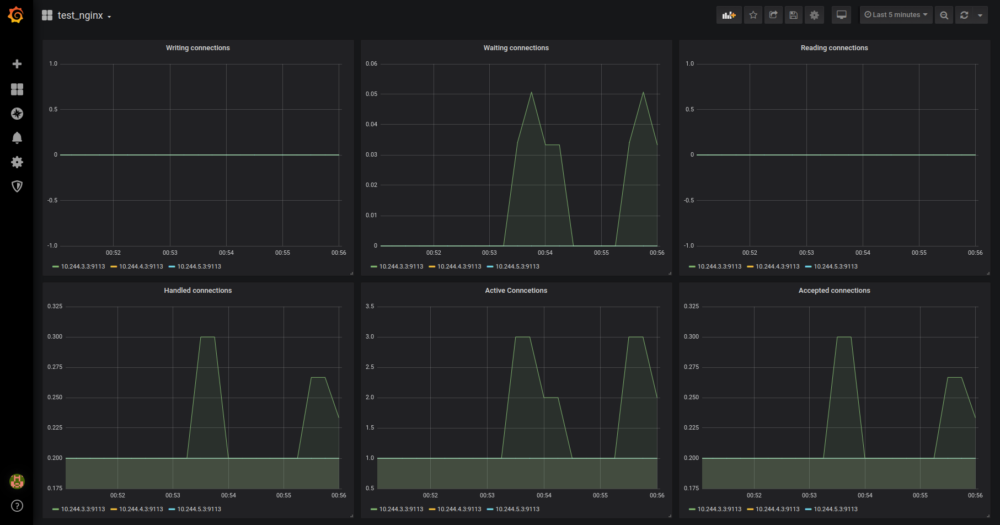

# Домашнее задание 8

[Содержание](../README.md)

*NB: Использован дистрибутив `Ubuntu 18.04` с предустановленным `docker`, `kind` и `VirtualBox` ПО.*

1. Создадим кастомный образ nginx:

    Начнём с Dockerfile.
    Чуть-чуть модифицируем уже существующий образ из `kubernetes-intro`. Добавим домашнюю страничку и конфигурацию, для сора базовых метрик.

    Соберём образ, добавим новый тег. Запустим и проверим, его работу.

    ```bash
    cd kubernetes-monitoring/nginx
    docker build --tag gidmaster/nginx:v0.2 .
    docker run -d -p 8000:8000 gidmaster/nginx:v0.2

     curl http://localhost:8000
    <html>
        <head>Homework 08</head>
        <body>
            <p>Nginx for monitoring</p>
        </body>
    </html>

    curl http://localhost:8000/basic_status
    Active connections: 1
    server accepts handled requests
    3 3 3
    Reading: 0 Writing: 1 Waiting: 0
    ```

    Работает! Теперь запушим образ в репозиторий:

    ```bash
     docker push gidmaster/nginx:v0.2
    ```

2. Поднимем кластер `kind`

    ```bash
    cd kubernetes-monitoring
    kind create cluster --config cluster.yml
    ```

3. Имплементим наш "мониторинг"

    Создадим отдельный namespace для prometheus-operator и запустим в нём prometheus используя `helm chart` и да простит меня *Бласковиц*, что я пошёл по лёгкому пути.

    ```bash
    kubectl create ns prometheus
    helm upgrade --install prometheus-operator  stable/prometheus-operator --namespace=prometheus --wait -f values.yml
    ```

    Запустим наш deployment с nginx, service и servicemonitor

    ```bash
    kubectl apply -d deployment.yml
    kubectl apply -d service.yml
    kubectl apply -d servicemonitor.yml
    ```

    Пробрасываем порты в графану:

    ```bash
    kubectl port-forward  --namespace prometheus svc/prometheus-operator-grafana 8000:80
    ```

    Импортируем `grafana-dashboard.json`, которая доступна по `http://localhost:8000`

4. Смотрим на результат

    Бробрасываем порты в service nginx и иммитируем деятельность:

    ```bash
    kubectl port-forward svc/nginx 8080:80
    ```

    ```bash
    curl http://localhost:8080
    ```

    Должны увидеть, что-то похожее:

    

[Назад к содержанию](../README.md)
